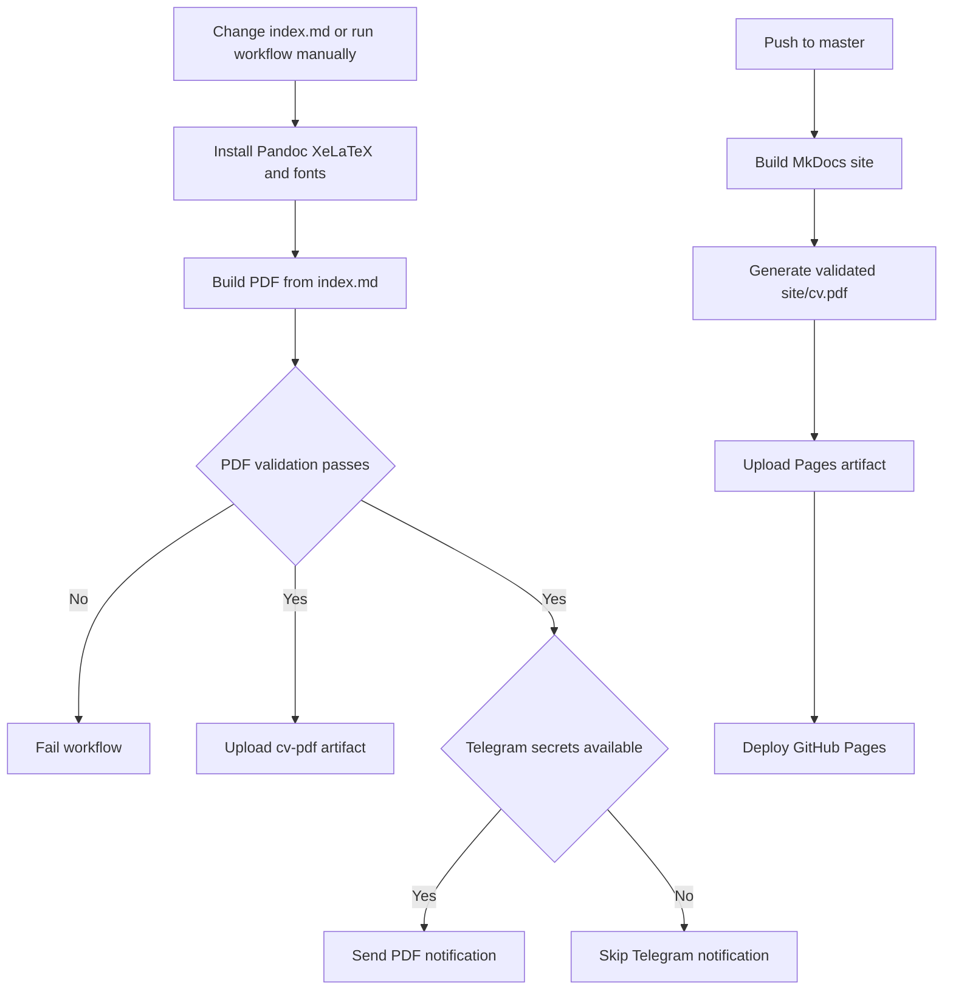

# PDF generation flow

```mermaid
flowchart TD
    A[Change index.md or run workflow manually] --> B[Install Pandoc XeLaTeX and fonts]
    B --> C[Build PDF from index.md]
    C --> D{PDF validation passes}
    D -- No --> E[Fail workflow]
    D -- Yes --> F[Upload cv-pdf artifact]
    D -- Yes --> G{Telegram secrets available}
    G -- Yes --> H[Send PDF notification]
    G -- No --> I[Skip Telegram notification]

    J[Push to master] --> K[Build MkDocs site]
    K --> L[Generate validated site/cv.pdf]
    L --> M[Upload Pages artifact]
    M --> N[Deploy GitHub Pages]
```
