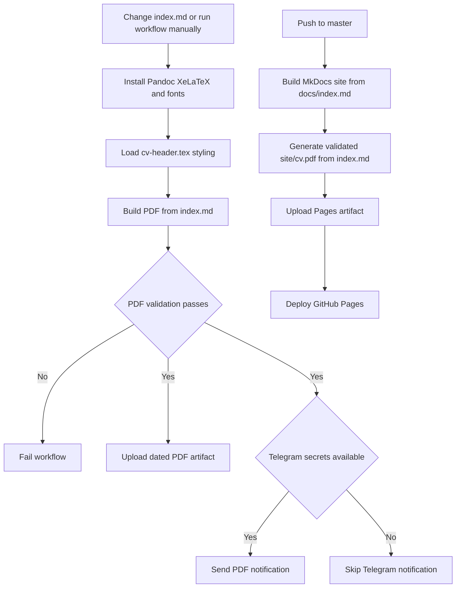

# PDF generation flow

```mermaid
flowchart TD
    A[Change index.md or run workflow manually] --> B[Install Pandoc XeLaTeX and fonts]
    B --> C[Load cv-header.tex styling]
    C --> D[Build PDF from index.md]
    D --> E{PDF validation passes}
    E -- No --> F[Fail workflow]
    E -- Yes --> G[Upload dated PDF artifact]
    E -- Yes --> H{Telegram secrets available}
    H -- Yes --> I[Send PDF notification]
    H -- No --> J[Skip Telegram notification]

    K[Push to master] --> L[Build MkDocs site from docs/index.md]
    L --> M[Generate validated site/cv.pdf from index.md]
    M --> N[Upload Pages artifact]
    N --> O[Deploy GitHub Pages]
```
