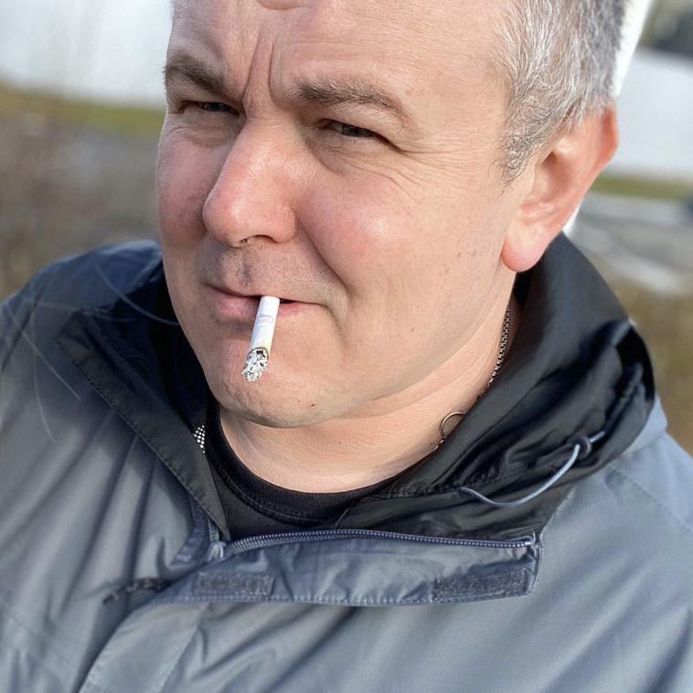

# Max I. Shaposhnikov

### Senior Systems Engineer, 
### Build,Release and Configuration Manager

#### Kiev,Ukraine

* Birth		12.01.1976
* Phone:		+380688062252
* email     [Max I. Shaposhnikov](mailto:shaposhnikoff@gmail.com?subject=[GitHub]%20CV) 
* telegram		[shaposhnikoff](https://t.me/shaposhnikoff)
* Amateur radio callsign [UT3UDX](https://www.qrz.com/db/UT3UDX)

Link to this CV in [PDF](shaposhnikov_cv.pdf) 

## Education

### Moscow Technical University of Communication and Informatics (MTUCI) 

1992 - 1997

Software of computers and automation systems
 

## Skills and Qualifications

I am a qualified specialist with extensive hands-on experience in build  engineering, configuration management, and DevOps practice.

My key expertise includes design and implementation of continuous integration, delivery, and deployment using Jenkins,Gitlab CI/CD,Argo CD/CD, Git, Docker, 
Vagrant, Ansible, and AWS/EC2.

I also have considerable skills in automating deployments of Java appllications with Tomcat, and AWS, as well as almost 20 years of experience 
in UNIX/Linux and Middleware/Application Server administration experience.

Being a self-motivated, responsible, and sociable team player, I can use my technical expertise to implement quality solutions and bring added value.

Detailed technical knowledge and hands-on experience of Build Engineering, Configuration Management and DevOps Engineering

* Linux, Docker, Swarm, Kubernetes, Mesos, Consul[-template], Packer, Vagrant, MySQL,Redis, Shell, Ansible, Solr, 
	Artifactory, Nexus, Git, Nginx, Nagios, Zabbix, Hybris, HAProxy, SQL, Apache, Logstash, Elasticsearch, Kibana, 
	Fluent-bit/Fluentd, FreeRADIUS, TCP/IP, DNS, SNMP,LDAP, RADIUS, HTTP(S), RESTful, XML, JSON.
	
* Jenkins - Release build out, environment, deployment, configuration, continuous delivery, Gerrit integration
	
* Docker - pack Java microservices into a shipping containers , which will be deployed to Kubernetes.
	
* Kubernetes - Jenkins CI/CD - [ARGO](https://argoproj.github.io/) Ci/CD integrations, include creating fully automated build 
	environments, with 	Amazon (Gitlab/Dockerhub) container service as Docker registry, Kubernetes as Jenkins nodes 
	runner and Spring Boot application Docker images hosting.
	
* Centralized pods logging , using Elasticsearch/Fluent-bit
	
* HELM package creation , to improve deployment speed.
	
* Centos, Debian, Ubuntu, CoreOS
	
* Virtualization - Docker, KVM, LXC, Libvirt, Vagrant
	
* [Mirantis OpenStack MCA200](https://training.mirantis.com/verify/certificate/status/jJg3rA0WJsg2IIZ-TyAHLw/200-692-449)
	
* Backup, automation infrastructure changes with Ansible 
	
* Tracking system - Redmine, Jira,Trac
	
* Monitoring - Prometheus (alertmanager, blackboxexporter. all types of exporters), Nagios,Zabbix
 
### Self-educated, self-motivated, responsible, sociable, good team player, ability to work under pressure.

# Related Expirience

### Grid Dynamics 
#### Senior Systems Engineer

######  Dec , 2019 - Now
######  Google Cloud Engine - Frontend ( Pantheon project )
######  Release engineer                                                                                                  
Main responsibilities on the project 

   * Main responsibilities ( operational part )  on the project
   * Making sure that's the rapid/pantheon is producing releasable candidates. 
   * Triage and resolve release issues
   * Develop, vetirify, test and automate Pantheon releases
   * Oncall prod SRE
   * Rollout, rollback of releases and other release engineering duties 
   * Verifying blessed release and push additional candidates to build
   * Keep tracking of the progress on manual tests, resolve it if needed
   * Always be release ready

Development part of activities on the project  

   * Develop release automation code
   * Code reviews of team members work
   * Work with the SRE  and development team to design and develop scripts to operate Deployment process
   * Review and provide feedback on technical details of developers team
   * Assist Principal Engineers  with project scope
   * Provide maintenance of Application Lifecycle Management ( full scope of tasks, starting from developing  custom scripts which monitor count of open bugs and issues and ending develop  scripts to send custom notifications to developers, which bugs are expired and block project release processing ) 

 
######  Dec,2018 - Dec 2019 
######  IOT && ECS project for Jabil company

Main responsibilities on the project 

   * AWS ( ES2, SNS, SQS, IoT Core, Lambda, S3, Route 53, ACM, WAF, KMS, DynamoDB, ECS Fargate, ECR, Cognito, Codebuild) , Docker, Terraform, Ansible, Azure Devops, Jenkins - pipelines, releases, AWS integration ( Codebuild, Codedeploy)
   * 	 Create and maintain full stack of Terraform infrastructure in AVS - creating infrastructure for 
   * ECS ( Fargate, task definitions and service descriptions )  
   * ELB ( Application LB, target groups for set of Docker containers)  
   * ECR ( Automated creation Docker repo from CI/CD pipelines ) 
   * ACM ( Automated provision of Letsencrypt / Other types of certs ) 
   * VPC ( Subnets , Nat GW, IGW ) 
   * Route53, SNS,SQS , Lambda
   * Hashicorp Packer provision containers  for AWS ( creating custom AMI, upload it to S3, deploy to EC2)
   * Maintenance of project infrastructure ( CI/CD pipelines ( Jenkins) , Help with creating Dockerfiles, knowledge sharing )
   * Create and maintaince Kubernetes cluster which work as Jenkins slave runner for needs of Development team ( Kubernetes run specific 			pods , for example with specific version of Node.js and this allow developers to run various environments to getting the best 			results ). We use Kubernetes cluster for these purposes because we can start and stop pods in cluster very quickly

All this infrastructure are developed to use in separate environments, so, to prepare it to use in dev, or stage, or prod we need to 		change only AWS Network settings ( VPC, SG, Subnets) and we ready to apply this configuration to another account.

                                                                                                                                        
### First Ukrainian International Bank 
#### Senior Systems Engineer
######  Apr, 2017 - Dec , 2018

  * Automated build and deployment process with Gitlab CI, eliminating 80% of manual work
  * Automated deployments for 200+ cloud servers( EC2/ECS) using Ansible ,Terraform and Bash.
  * Corezoid digital core (c) @corezoid.com maintanance , scaling, deployment , support , monitoring and configuration management.
  * Applying configuration changes using Ansible, AWS, Terraform, Packer, etc.
  * Maintanance of K8S cluster, creating HELM charts for Jenkins deployed microservices via Jenkins jobs,configuration and patch management

### EPAM Systems 
#### Senior Systems Engineer
######  Feb 2014 - Apr 2017 

  * Design and develop continuous deployment pipeline, integrating Test-Kitchen, Docker, Git , Jenkins and Ansible across geographically separated hosting zones in AWS.
  * Performed new Ansible automation to replace old-bash-style scripting tools to provide Continous integration / Continous delivery of results working of Development team
  * Performed custom Docker integration solution to run test suites ( functional, unit, web, integration tests ) - running tests in docker-compose created environment with hybris image and wide range of mysql database versions.
  * Developed from scratch fully completed CI/CD solution (Jenkins/Docker/Ansible based) to build and deploy artifacts starting from git pull and ending to checking Hybris startup logs and email notification to dev team members.
  * Developed many fully customized Ansible playbooks for maintanence next application on customer cloud - Apache Solr Cluster, SMTP server Postfix.
  * Also, created and maintained everyday ansible automation and special automated branch to GoLive production environment's
  * Collect the new technologies and tools, and introduced them to the client; in which way it helped the company build up an agile development environment - it improved the product quantity and the work efficiency.
  * Developed automation and deployment utilities using Bash and Ansible.
  * Designed and developed automated deployment and scaling processes based on Docker and Ansible for a wide range of server types and application tiers, including Elasticsearch, Tomcat, Varnish And SOLR Clusters.
  * Wrote custom monitoring and integrated monitoring methods into deployment processes to develop self-healing solutions.
  * Created automation and deployment templates for relational databases (standalone and RDS).
  * Wrote custom monitoring and integrated monitoring methods into deployment processes to develop self-healing solutions (Zabbix && Ansible ).

### Special Integral Systems
#### Senior Systems Engineer 
######  Jan 2011 - Jan 2014 

  * Build Automation - Create Jenkins automated building internal projects..
  * Continuous Integration of building and testing a software projects continuously, each time new changes are made.
  * Continuous Testing - running Unit tests on build applications on previous step.
  * Continuous Delivery - running (creating) containers ( Docker/Vagrant) and running applications inside it for developers proposes. 
    All delivery steps automated with Ansible/Chef recipes.
  * Continuous Monitoring - monitoring created Vms automatically with Zabbix agent orchestration via Ansible
  * Server configuration management via Ansible/Chef
  * Advanced OpenVPN deployment ( ipv6 include )
  * Capacity planning, Bottleneck identification
  * PXE kickstarting of CentOS/Ubuntu servers

### IXC company 
#### Chief networking engineer
######  January 2009 - January 2011
 

  * Working with the Engineering team to design, build and maintain scalable systems that support high traffic web services and back-end tools and applications
  * Planning and executing projects to improve production infrastructure
  * Performing and automating production deployments
  * Create continuous integration build server ( night build's) with Jenkins 	server 
  * Wrote design specifications and performed Quality Assurance testing on prototype hardware.
  * Specified desktop and network hardware for the development team; proposed initial network designs;
  * Researched network and database security requirements for WAN and LAN ; outlined office and test lab environments.
  * Setup and support developers environment, installation and configuration IXCSoftswitch for VOIP providers, database tuning.
  * Setup High-Availability Storage With GlusterFS On Ubuntu 10.04
  * SVN, mail, web, VPN servers support.
  * Developed a simple High Availability solution for corporate webserver and database server utilizing VRRP.
  * Responsible for all internal and external DNS using BIND9

### Golden Gate 
#### Unix & Voip Engineer
######  January 2006 - January 2009

http://www.zv.ua

  * Admin of corporate communications corporation "Golden Gate"
  * Implementation and fine tuning of corporate VOIP/TDM network based on Asterisk (FreeBSD)
  * Organization and implementation of corporate telephone network based on Asterisk (FreeBSD)
  * Expand corporate VOIP infrastructure to add remote subsidiaries in the following cities: Vinnitsa, Sevastopol, Simferopol, Kharkov, Uzhgorod
  * Integrate Panasonic PBX with Asterisk using H.323 protocol stack.
  * Integrate Asterisk PBX with TDM using a common interface cards FXO FXS ISDN PRI
  * Writing routing logic PBX Asterisk, IVR, voice mail support
  * The daily administration of servers running FreeBSD.
  * Support for network services: firewall, dns, ntp

### Ukrtelecom ISP
#### System Administrator
######  Jan 2000 -  November 2006
  

http://crimea.ukrtelecom.ua 

  * Engineered, implemented and administrated network WAN/LAN. Provided technical support for Cisco and software routers OS FreeBSD (zebra).
  * Pre sales engineering of customers networks for the purpose of discovering.
  * Configured and administrated servers with SMTP, DNS, HTTP, RADIUS, VPN, PPPoE, PPtP, DHCP. Programming Shell, PHP a little .

## Other

  Married, ready for business trips.

# Hobby 

programming IOT, ESP32 / ESP8266, creating custom firmware for these boards (based on Tasmota / ESPhome),

  * I develop from scratch (and update from time to time) the IOT infrastructure of my Smart Home, 
  * Create and develop Smarthome Core configurations (HomeAssistant/Mosquitto MQTT broker, Prometheus/Grafana) 
  * Develop ( and update )  SmartHome software ( mainly OTA ) configurations for various devices 
    * Tuya smart plugs
    * Sonoff switches 
    * RTMP security cameras
    * wide scope of humidity/temperature/water( and air) pressure /current/voltage/power consumption sensors) 

Making software support of monitoring / checking / load balancing internal infrastructure to perform best practices of IOT 

Also, i have a HAM radio licence in Ukraine - callsing UT3UDX
and have a technician expertise in:

* DMR
* Hot Spots
* Duplexers
* SVXLink
* Repeater Builds

and also i maintain the free repo of Brandmeister Digital contacts in CSV format

[http://bm-digital-contacts.shaposhnikoff.info](http://bm-digital-contacts.shaposhnikoff.info)

