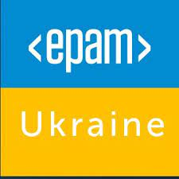

# Maksym Shaposhnikov
#### Results-Driven Experienced Devops Engineer with strong Python background | Software developer |AWS | Ansible | Terraform | Docker | Kubernetes | Helm | ArgoCD

* telegram		[shaposhnikoff](https://t.me/shaposhnikoff)
* English level B2+
* Location Kiev/Ukraine

### RESUME SUMMARY

Advanced DevOps Engineer With Python Experience specialized in crafting and maintaining AWS-based cloud infrastructure. Proficient in Python, Bash, and automation tools like Ansible and Terraform.

My core competencies encompass architecting seamless continuous integration, delivery, and deployment pipelines using Gitlab CI/CD, Jenkins, Git, Docker, Vagrant, Argo CD/CD, and AWS/EC2.

  * Strong understanding of DevOps principles and methodologies.
  * Strong experience with Python
  * Prometheus/Grafana, ELK Stack
  * Proficiency in cloud infrastructure management using AWS.
  * Experience in configuration management using Ansible,Terraform,Terragrunt.
  * Working knowledge of Kubernetes and Docker containerization.
  * Expertise in Continuous Integration/Deployment (CI/CD) using Jenkins and ARGO CI.
  * Familiarity with scripting languages such as Python, Bash.
 
### WORK Experience

 
 
 
 
 

#### Raiffeisen international - Senior Devops Engineer 
##### Jan,2023 - now

  * AWS multiaccount IAM roles and permissions maintanence ( Glue, Athena, EMR, Airflow crossaccount permissions hell maintenance
  * Implement GitOps practices and container orchestration using Kubernetes,Harbor and Helm
  * Simplifying Kubernetes for Data Scientists/Engineers: Developed user-friendly containers, enabling Data Scientists to utilize Kubernetes effortlessly. Achieved a complete transition to Kubernetes infrastructure with a 40% cost saving💸
  * Reusable Data Pipelines: Assisted Data Engineers in accelerating their workflow by refining and creating reusable data pipelines, leading to a robust library of reusable data engineering tools.
  * Designed and implemented end-to-end ETL workflows using Apache Airflow, orchestrating the extraction, transformation, and loading of data from diverse sources into a centralized data warehouse ( mostly CSV's from S3 buckets ) .
  * Developed and maintained simple Airflow DAG's for scheduling and monitoring ETL tasks, ensuring timely and accurate data processing.
  * Manage artifact repositories and enable Continuous Integration/Deployment (CI/CD) pipelines using Harbor and GitHub Actions Workflows
  * Implement and enable monitoring solutions using Prometheus,Alertmanager,Blackbox and Grafana to ensure proactive issue detection and resolution
  * Build and check security issues with Docker containers with Trivy 
  * Make crossaccount deployments for internal Bank teams with Terragrunt ( and make modules in Terraform for that )
  * Utilized scripting (Python and Shell) for automation of routine tasks, improving operational efficiency.
  * Actively participated in Agile and DevOps methodologies, contributing to the continuous improvement of development and deployment processes.
    
 
 
 
 
 

#### Zoolatec - Senior Devops Engineer
##### Dec,2020 - Jan,2023

  * [EMR](https://aws.amazon.com/emr/) (Elastic Map Reduse ) AWS based clusters,EMR servers templates, [EMR studio](https://aws.amazon.com/emr/features/studio/) deployment and Support, DataLake, Glue Databases and Tables, IAM roles, permissions and access
  * Terragrunt multiaccount , multitieams architecture, deployment and development
  * Kubernetes: Proficient in managing Kubernetes clusters, deploying and scaling applications, configuring networking, and troubleshooting issues.
  * Helm: Skilled in utilizing Helm charts for packaging and deploying applications in Kubernetes, managing dependencies, and ensuring reproducibility.
  * [ArgoCD](https://argo-cd.readthedocs.io/en/stable/): Experienced in implementing ArgoCD for GitOps-based continuous deployment, automating application deployment and monitoring synchronization.
  * GitOps: Proficient in applying GitOps principles to maintain infrastructure and application configurations as code, enabling automated deployments and version control.
  * [Continuous Integration/Continuous Deployment](https://www.redhat.com/en/topics/devops/what-is-ci-cd) (CI/CD): Implementing and optimizing modern CI/CD pipelines to automate build, test, and deployment processes, ensuring rapid and reliable software releases based on Github Actions.
    Infrastructure as Code (IaC): Creating ifrastructure utilizing tools like Terragrunt/Terraform or Ansible to provision and manage infrastructure resources, enabling reproducibility and scalability. Importing Clickops based infrastructure to Terraform 
  * Scripting and Automation: Proficient in scripting languages (e.g., Bash, Python) and automation tools to streamline repetitive tasks, improve efficiency, and enhance system reliability.
  * Monitoring and Logging: Experience with monitoring tools (e.g., Prometheus, Grafana) and log aggregation platforms (e.g., ELK Stack) to proactively monitor system health, identify performance bottlenecks, and troubleshoot issues.
 

 
 
 
 
 

#### Grid Dynamics - Senior Devops Engineer
######  Dec,2017 - Dec,2020

  * Designed and managed the cloud infrastructure on AWS for PROD&&DEV environments.
  * Developed scripts using Bash and Python to automate infrastructure deployments and configuration management.
  * Implemented monitoring and logging systems to provide visibility to the infrastructure and applications.

 
 
 
 
 

#### EPAM Systems - Senior Devops Engineer
######  Feb 2014 - Apr 2017 

  * Design and develop continuous deployment pipeline, integrating Test-Kitchen, Docker, Git, Jenkins and Ansible across geographically separated hosting zones in AWS.
  * Performed new Ansible automation to replace old-bash-style scripting tools to provide Continuous integration / Continuous delivery of results working of Development team.
  * Performed custom Docker integration solution to run test suites (functional, unit, web, integration tests) - running tests in docker-compose created environment with hybris image and wide range of MySQL database versions.
  * Developed fully completed CI/CD solution (Jenkins/Docker/Ansible based) from scratch to build and deploy artifacts starting from git pull and ending to checking Hybris startup logs and email notification to dev team members.
  * Developed many fully customized Ansible playbooks for maintenance next application on customer cloud - Apache Solr Cluster, SMTP server Postfix.
  * Also, created and maintained everyday ansible automation and special automated branch to GoLive production environments.
  * Collect the new technologies and tools and introduced them to the client; in which way it helped the company build up an agile development environment - it improved the product quantity and the work efficiency.
  * Developed automation and deployment utilities using Bash and Ansible.
  * Designed and developed automated deployment and scaling processes based on Docker and Ansible for a wide range of server types and application tiers, including Elasticsearch, Tomcat, Varnish and SOLR Clusters.
  * Wrote custom monitoring and integrated monitoring methods into deployment processes to develop self-healing solutions.
  * Created automation and deployment templates for relational databases (standalone and RDS).
  * Wrote custom monitoring and integrated monitoring methods into deployment processes to develop self-healing solutions (Zabbix && Ansible).

